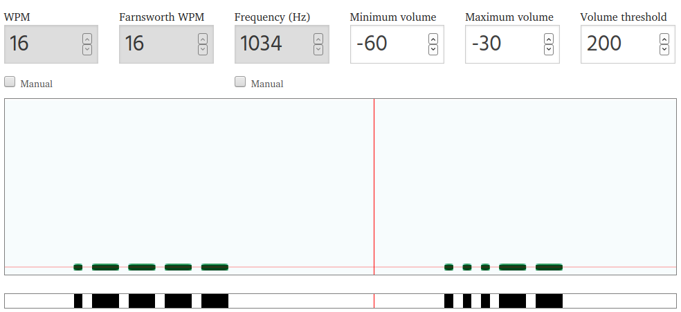

# Beepbeep!

## Challenge

No description, only a [WAV file](./beepbeep.wav)

## Solution

By listening at the audio file, we're clearly have to deal with a Morse code. This website  can decode audio Morse into text: https://morsecode.world/international/decoder/audio-decoder-adaptive.html



With the default parameters, the Morse code is correctly decoded:

```
51555A475131524765303150556C4E465130394552555A50556C4A4655304E565258303D
```

Going through an HEX to ASCII converter such as https://www.rapidtables.com/convert/number/hex-to-ascii.html:

```
QUZGQ1RGe01PUlNFQ09ERUZPUlJFU0NVRX0=
```

That's clearly to a base-64: https://www.base64decode.org/

## Flag

```
AFFCTF{MORSECODEFORRESCUE}
```