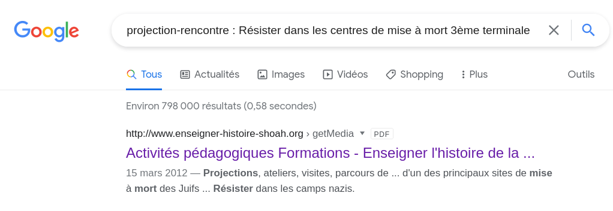
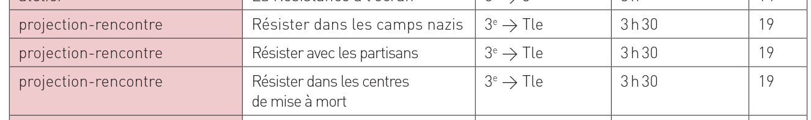
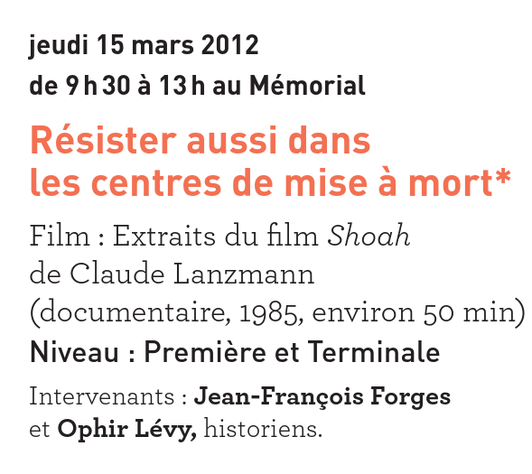

# Devoir de mémoire

**« Ceux qui ne connaissent pas leur histoire s'exposent à ce qu'elle recommence. »** disait Elie Wiesel, rescapé d'auschwitz. Transmettre l’histoire aux nouvelles générations est une mission  essentielle. Le mémorial de la Shoah de Paris propose aux élèves de  primaire, collège et lycée des projections, ateliers, visites, parcours  de mémoire, … Ces activités pédagogiques et mémorielles suivent l’évolution des  élèves, du primaire au lycée et aborde notamment l’histoire de la Shoah  dans le respect des âges et des sensibilités du public. **Question : Combien de temps durait la projection-rencontre :  “Résister dans les centres de mise à mort”, proposée en 2011 / 2012 aux  élèves de la 3ème à la terminale?** (durée en minutes)

## Solution

Un bon coup de Google nous renvoit un résultat intéressant : http://www.enseigner-histoire-shoah.org/getMedia.aspx?ID=168&D=attachment



On retrouve bien l'événement qui nous intéresse :



Et il faut faire attention à ne pas regarder uniquement la durée du film...



```
bleuetdefrance{210}
```

