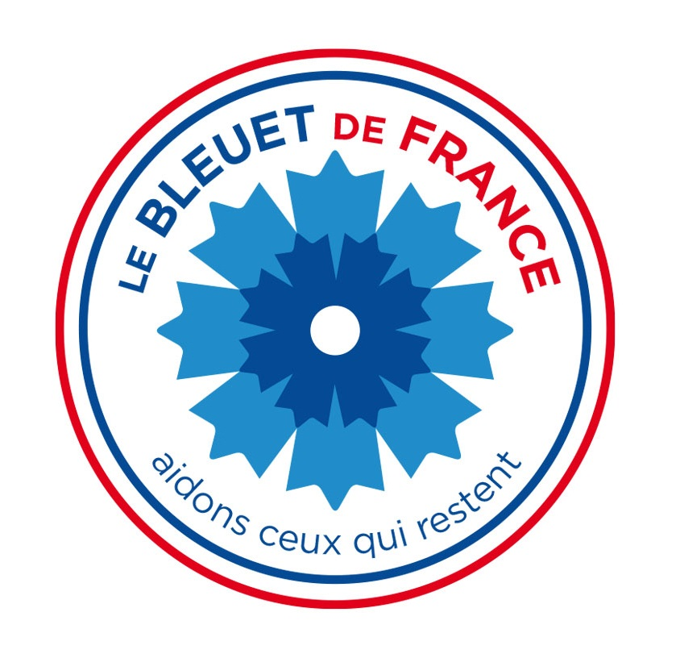
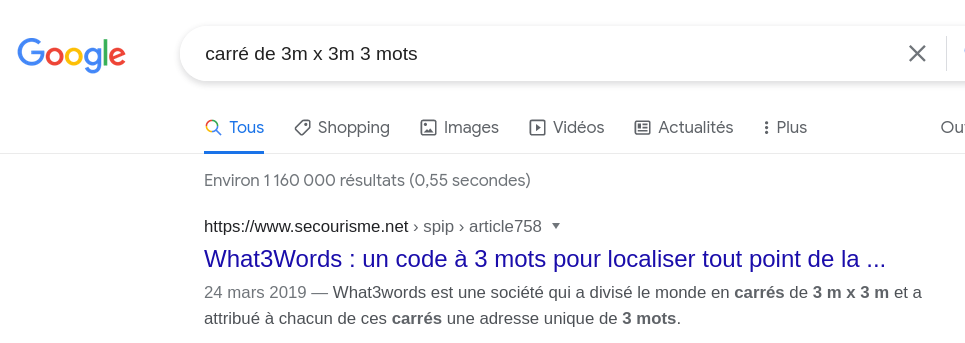
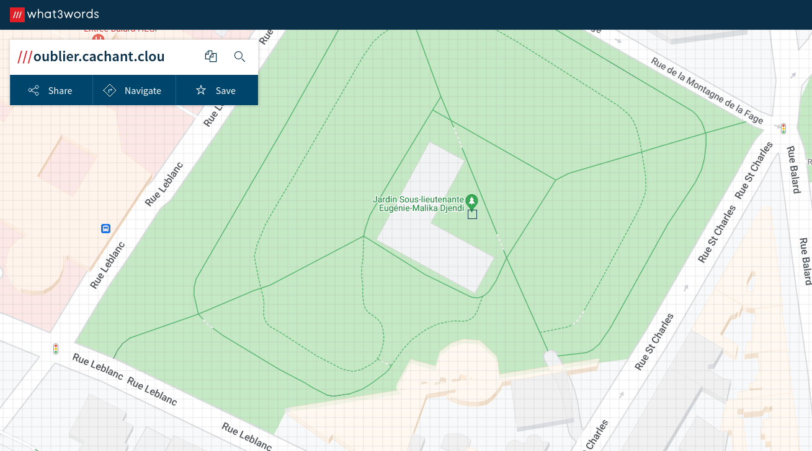

# Mémoire et solidarité

 

**Question : Aujourd’hui, que pouvons nous trouver en ce lieu sous le code : ///oublier.cachant.clou ?**

## Solution

Un hint gaché sur celui-là... Les trois mots sont importants mais les `///` le sont tout autant si ce n'est plus.

Le hint : 

> Saviez-vous que chaque carré de 3m x 3m dans le monde correspond à une adresse unique de 3 mots ?

Un coup de Google :



Dans des contextes particuliers, indiquer une adresse avec 3 mots semble bien plus simple à retenir/transmettre que des coordonnées GPS classiques.



Quelques infos sur le fonctionnement de what3words : https://what3words.com/about

On arrive donc sur un jardin nommé en mémoire d'une résistante : https://fr.wikipedia.org/wiki/Jardin_Eug%C3%A9nie-Djendi. Et là, il faut bien lire l'énoncé : "nous trouver **en** ce lieu". On ne cherchait pas le nom du jardin en lui-même, ni le nom de la résistante mais le monument présent (pourtant indiqué sur le Wikipedia du jardin) : https://fr.wikipedia.org/wiki/Monument_aux_morts_pour_la_France_en_op%C3%A9rations_ext%C3%A9rieures

```
bleuetdefrance{monumentopex}
```


