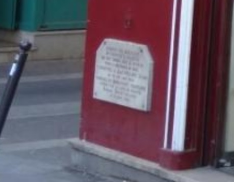
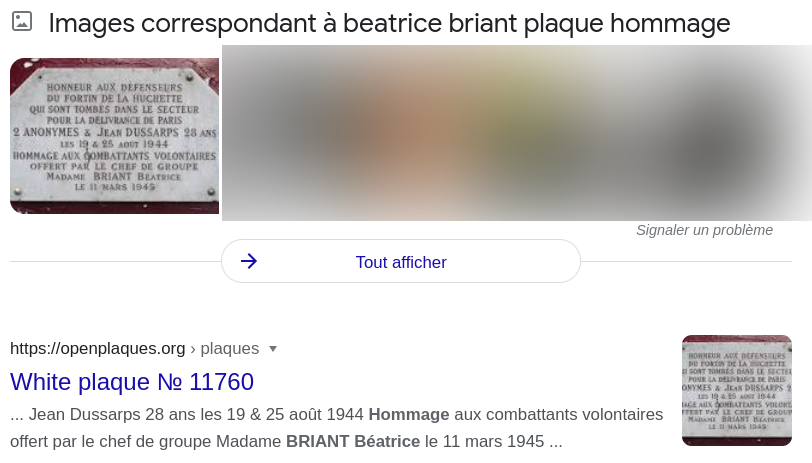

# Passant, souviens-toi !



Les plaques commémoratives jalonnent les avenues de la capitale et évoquent le sacrifice ultime. Béatrice BRIANT a dédié une plaque en hommage à ses camarades tombés au combat les 19 & 25 août 1944. **Question : Encore visible aujourd’hui, quel est le nom inscrit sur la plaque à côté des 2 anonymes ?**

## Solution

Une recherche Google "beatrice briant plaque hommage" nous renvoit un résultat intéressant :



https://openplaques.org/plaques/11760


```
bleuetdefrance{dussarps}
```

