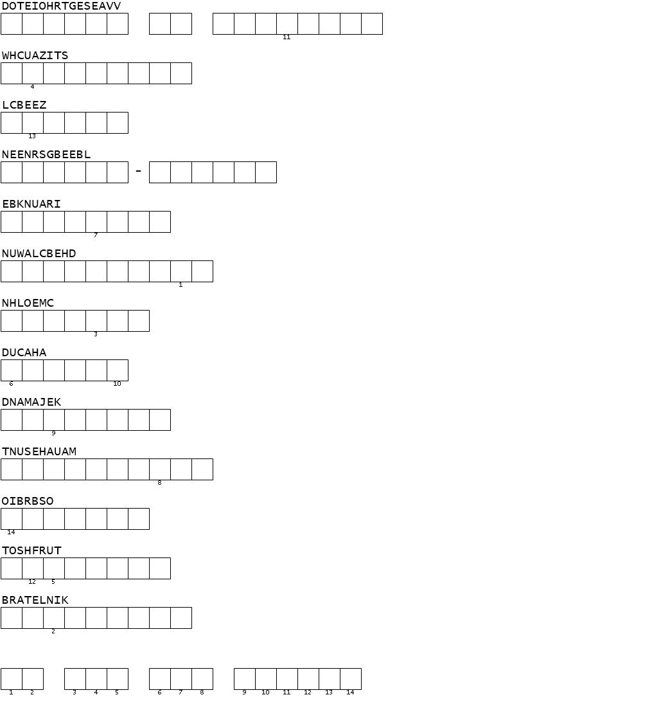

# Puzzle Mémoriel



**Question : Déchiffrez le puzzle pour découvrir la phrase.**

## Solution

Un jeu de lettres classiques qu'on peut retrouver dans les magazines de cruciverbistes.

- Commençons par le mot le plus court. Vu la thématique guerrière du CTF, on arrive assez vite à DUCAHA => DACHAU.
- 2ème mot, avec le Z (lettre peu commune) : on percute assez vite sur Auschwitz.
- Et si les mots étaient une liste de camps de concentration ? De nombreux sites les répertorient, en voici un : https://www.jewishgen.org/forgottencamps/general/listefr.html
- On arrive au mot clé "Le mur des justes". Mur des Justes situé juste à côté du mémorial de la shoah : https://www.memorialdelashoah.org/le-memorial/les-espaces-du-musee-memorial/le-mur-des-justes.html

Etonnament, j'avoue avoir séché sur le premier nom de camp. Heureusement, on pouvait deviner la dernière lettre sans ça.

```
bleuetdefrance{lemurdesjustes}
```

