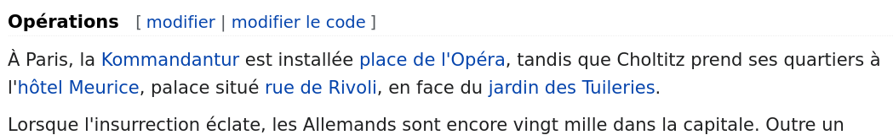
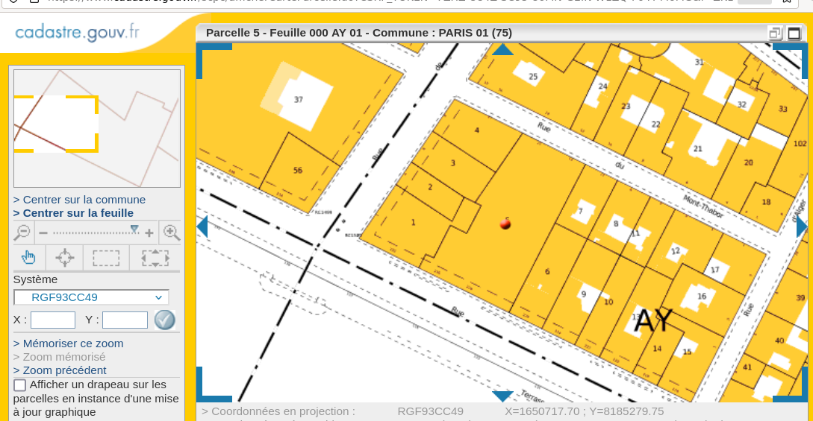

# Baroud d'honneur 					

Après un combat perdu d’avance, celui  qui avait promis aux parisiens les pires sévices s'ils osaient lutter  pour leur liberté fut capturé à son hôtel et la reddition allemande est  signée le 25 août 1944. **Question : Quel est la section et la parcelle cadastrale de  l’hôtel où séjourna durant l’occupation le gouverneur militaire de la  garnison du "Groß Paris" ?** (réponse tout attaché : section et parcelle, 3 caractères sont attendus)

## Solution

Première partie : qui était le gouverneur et quel était l'hôtel ?


https://fr.wikipedia.org/wiki/Dietrich_von_Choltitz



Reste à voir le cadastre lié à l'hôtel Meurice : https://www.cadastre.gouv.fr/scpc/rechercherPlan.do



```
bleuetdefrance{AY5}
```

