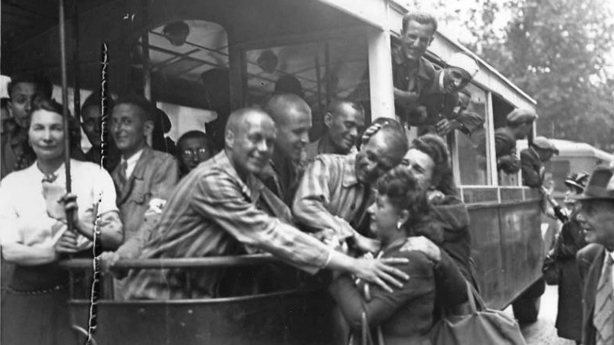
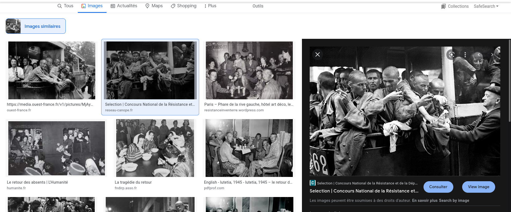

# Les cerises de la liberté 					



Dès la libération des camps, les déportés qui sont en état de supporter le voyage reviennent en France. L'Humanité du 19 avril 1945 raconte : "Dans toutes les rues, au passage des rapatriés, la population leur  réserve un accueil chaleureux. Lorsqu'un camion s'arrête, un  attroupement se forme. Les femmes offrent des fleurs, quelques  friandises." Les passagers du bus reçoivent des cerises lors de leur arrivée à Paris. **Question : Quel est le numéro de ce bus ?**

## Solution

Une recherche par images nous donnent la solution : https://www.reseau-canope.fr/cnrd/selection/nojs/5484



Un bus, des cerises et le numéro !

```
bleuetdefrance{62}
```

