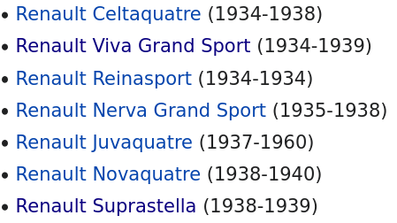

# Entrée dans Paris

Le 25 août 1944, le Général De Gaulle  entre dans une ville libérée de l’occupation allemande. Paris triomphe  grâce à la résistance que le général a lui-même représenté. Chacun de  ses déplacements a alors une valeur hautement symbolique, et politique. **Question : [Quel est le modèle complet du véhicule présidentiel utilisé par le général de Gaulle lors de ses déplacements ce jour-là](https://www.ina.fr/ina-eclaire-actu/video/i00007088/discours-le-25-aout-a-l-hotel-de-ville-du-general-de-gaulle) ?**

## Solution

Une vidéo est donnée en lien : https://www.ina.fr/ina-eclaire-actu/video/i00007088/discours-le-25-aout-a-l-hotel-de-ville-du-general-de-gaulle


L'image ne rend pas bien mais on voit la marque Renault sous le numéro de plaque. Une petite recherche Google nous donne une image bien plus nette du même véhicule (https://www.lexpress.fr/region/ile-de-france/paris-celebre-le-75e-anniversaire-de-sa-liberation-le-programme-des-festivites_2095677.html). Cherchons donc les modèles de Renault produits dans les années 30-40 https://fr.wikipedia.org/wiki/V%C3%A9hicules_Renault



Ma recherche a commencé au hasard par la [Viva Grand Sport](https://fr.wikipedia.org/wiki/Renault_Viva_Grand_Sport). Plusieurs types et on en trouve une qui ressemble très (très) fortement à la vidéo (https://www.artcurial.com/fr/lot-1938-renault-viva-grand-sport-cabriolet-bcx3-2366-231#popin-active)


Après avoir testé les différentes variantes, un indice a débloqué la situation :

> Malgré une production anecdotique, ce modèle de **luxe** est proposé dans une version **berline décapotable**. Il  à été livré en 1942 pour le **gourvernement en place**, mais la voiture servit pour d'autres président de la république jusqu’en 1950.

Encore une fois, lire plusieurs fois l'énoncé peut servir, on cherche un véhicule **présidentiel** et là, Wikipedia est votre ami : https://fr.wikipedia.org/wiki/Liste_des_v%C3%A9hicules_officiels_du_pr%C3%A9sident_de_la_R%C3%A9publique_fran%C3%A7aise. La Suprastella, produite pendant 1 an (!) était le bon choix.


Remarque personnelle : entre la [Suprastella](http://lautomobileancienne.com/wp-content/uploads/2016/12/renault-suprastella-spider-1.jpg), la [Viva Grand Sport](http://stubs-auto.fr/s/cc_images/teaserbox_54254075.jpg?t=1457266290) et la [Nerva Grand Sport](https://fr.wikipedia.org/wiki/Renault_Nerva_Grand_Sport#/media/Fichier:Renault_Nerva_Grand_Sport_(1).jpg), il y avait pas mal de similarités...

```
bleuetdefrance{renaultsuprastella}
```

