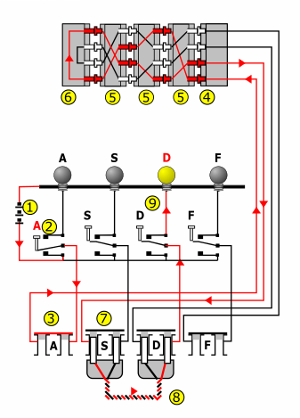
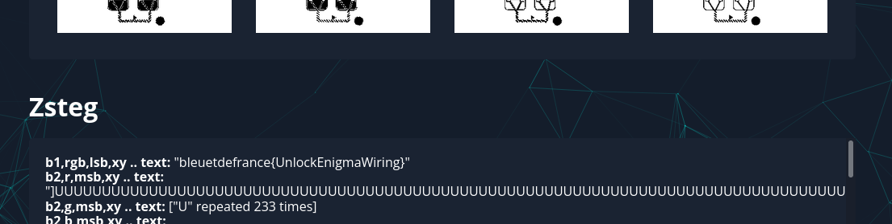

# Enigma

**Le réseau de résistance à réussi à  intercepter ce plan de chiffrement. Trouvez un moyen de le décrypter  pour récupérer son contenu.**



## Solution

Ca semblerait bizarre de devoir décoder un quelque branchement des rotors Enigma présents dans l'image. Dans le doute, passons l'image sur https://aperisolve.fr/ (un excellent site qui passe différents outils de stéganographie sur des images) :



zsteg donne directement la bonne réponse !

```
bleuetdefrance{UnlockEnigmaWiring}
```

