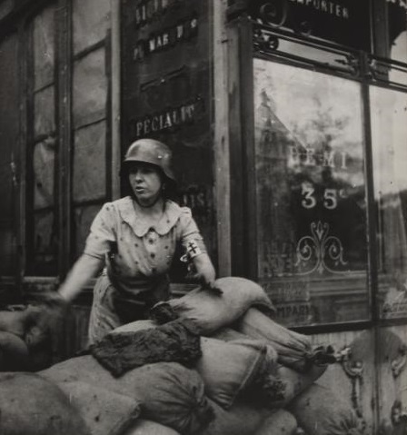
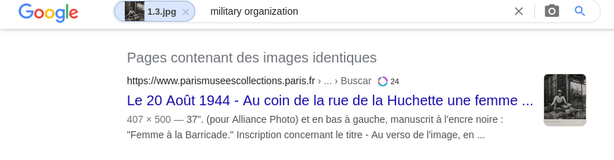
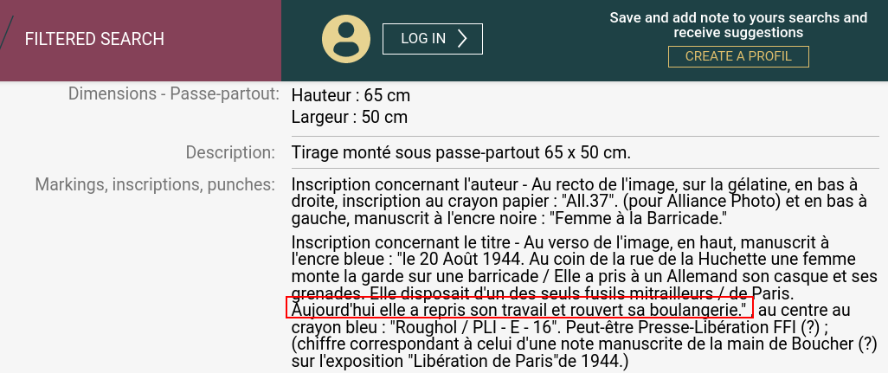
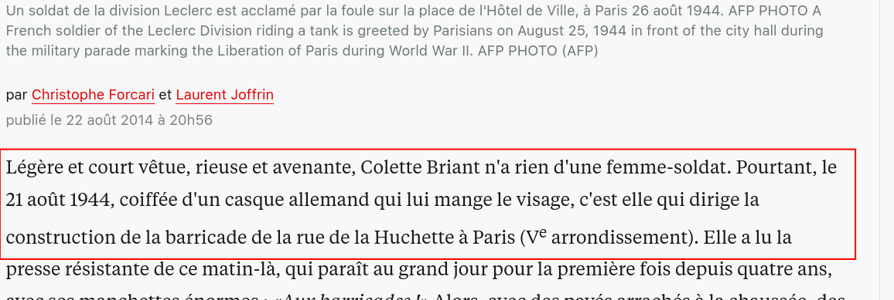

# Femme à la barricade



La libération de Paris commence le 19 août, quand les gaullistes et  la Résistance lancent un appel à l'insurrection. Dès lors, des  barricades se dressent dans les rues et des affrontements éclatent. On connaît le nom des héros de la Libération de Paris, moins celui  des héroïnes. En août 1944, cette chef de groupe de la résistance  accompagnée de ses camarades, participe à la libération de Paris. **Question : Quel est le nom et la profession de cette résistante?**

## Solution

Une recherche d'image nous remonte la photo d'origine https://www.parismuseescollections.paris.fr/es/node/130375#infos-principales :



Pas d'information sur le nom mais on apprend qu'elle était boulangère en regardant la description détaillée :



Une recherche Google "femme rue huchette résistance" nous amène sur un article fort intéressant sur la libération de Paris dans Libération : https://www.liberation.fr/societe/2014/08/22/aout-1944-la-liberte-guidant-paris_1085140/



```
bleuetdefrance{briantboulangere}
```

