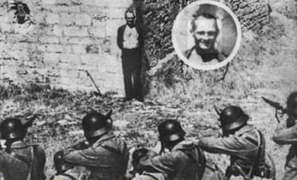
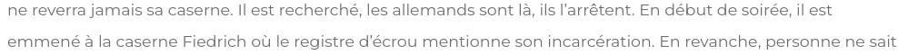
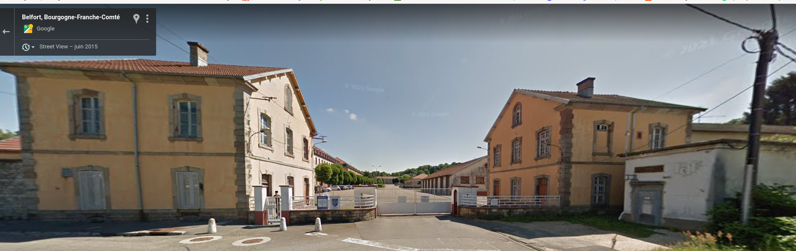
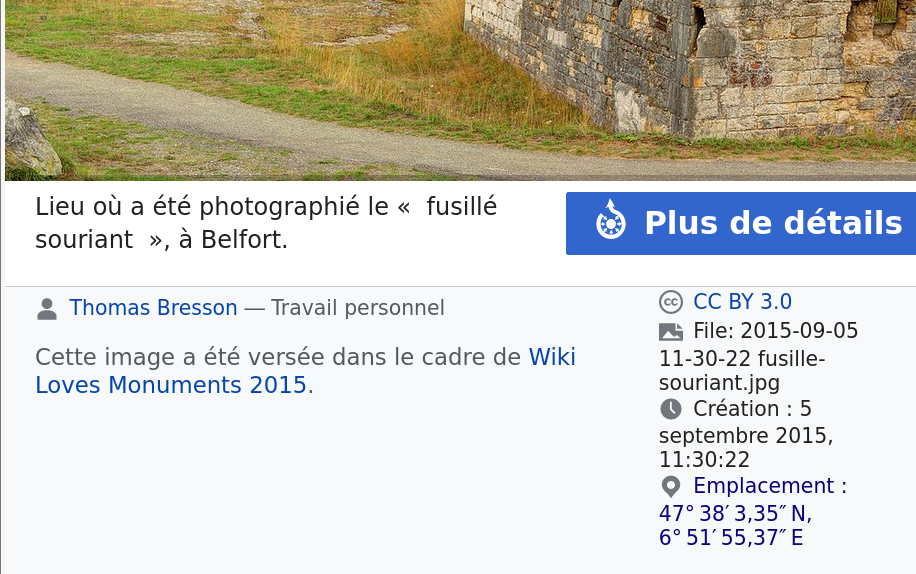
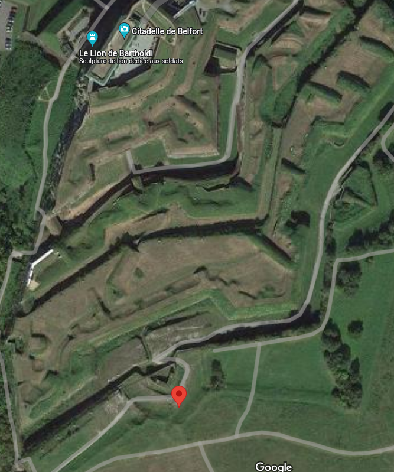

# Le fusillé souriant



Sourire plutôt que d'abdiquer : En  octobre 1944 à Belfort, mis en joue lors d'un simulacre d'exécution  destiné à le faire parler, le caporal infirmier Georges Blind souris  face aux fusils des soldats allemands. Malgré la menace des armes, il ne craquera pas et ne donnera pas les noms de ses camarades de réseau résistant. **Question : Quelles sont les coordonnées GPS exacte de ce lieu ?** (réponse en degrés sexagésimaux) *bleuetdefrance{XX°XX′X.XX″NX°XX′XX.XX″E}* /!\ Attention à bien respecter le format ci-dessus Le flag est insensible à la casse, mais veuillez à bien copier le format ci-dessus pour mettre toute les chances de son côté /!\ **Exemple : le site a du mal avec les différentes guillemets :  [″]  et ["]** En cas de doute, contactez un admin sur Discord.

## Solution

Encore un hint gâché...

Pour commencer, une recherche Google m'amène sur un résumé de l'histoire du fusillé souriant : https://historyweb.fr/georges-blind-fusille-souriant/

> 

Caserne Friedrich qui se situe à Belfort :



Problème : reste à trouver les coordonnées exactes. D'après l'énoncé du challenge, on connait déjà le nombre de chiffres {XX°XX′X.XX″NX°XX′XX.XX″E}.

Problème #2 : une seconde correspond à 30m (source : https://fr.wikipedia.org/wiki/Coordonn%C3%A9es_g%C3%A9ographiques#Position), on nous demande donc de trouver une position à 30 centimètres près... Après avoir cliqué un peu partout autour de la caserne (désolé...), le hint a été d'une grande aide :

> La réponse précise et exacte se trouve quelque part en source ouverte ;) Vous n'aurez pas besoin de chercher des coordonnées si vous êtes à  proximité du lieu !

En effet, premier résultat de Google : https://fr.wikipedia.org/wiki/Georges_Blind.



C'était pas plus compliqué que d'aller sur la page Wikipedia du fusillé souriant... Point qui se situe autour de la citadelle de Belfort :



Citadelle où l'on trouve d'ailleurs une chouette statue de lion liée à [une autre guerre](https://fr.wikipedia.org/wiki/Lion_de_Belfort) par le même Bartholdi qui a fait la statue de la Liberté :


```
bleuetdefrance{47°38′3.35″N,6°51′55.37″E}
```

