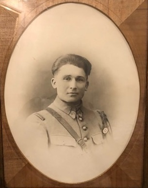
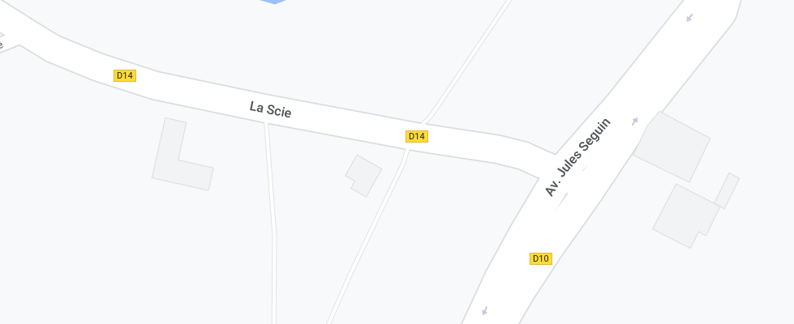
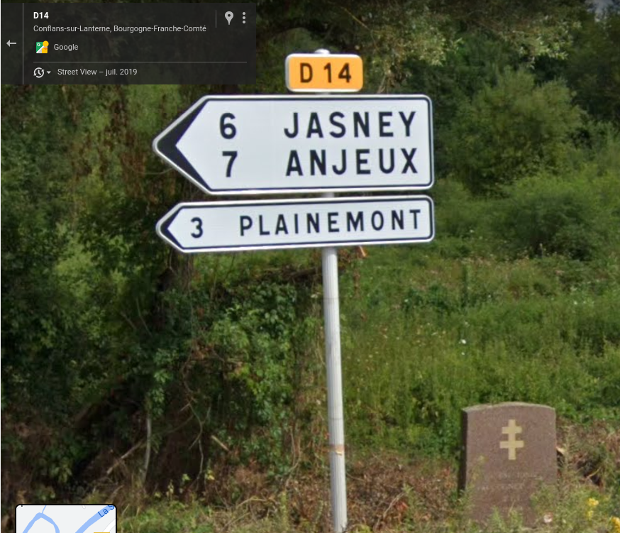

# Mort pour la France



Au fur et à mesure de la progression alliée et de la libération de la France, les groupes de maquisards combattent très violemment les  troupes allemandes. Le 8 septembre 1944, Jean FAUCOGNEY, résistant des Forces Françaises de l’Intérieur (FFI), tombe au combat pour la France. **Question : Quelles sont les communes présentes sur le panneau à côté de la stèle de Jean FAUCOGNEY ?** (réponse tout attaché et trié par ordre alphabétique)

## Solution

En cherchant cette stèle, on tombe sur un descriptif détaillé de la stèle : http://museedelaresistanceenligne.org/media10625-Stle-la-mmoire-de-Jean-Faucogney-Conflans-sur-Lanterne-Haute-Sane

Le nom des voies ne correspond pas à la réalité (heureusement les numéros sont corrects) :





```
bleuetdefrance{anjeuxjasneyplainemont}
```

