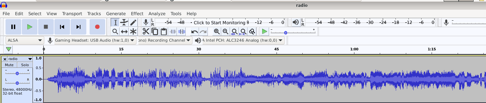

# Radio Londres

Le passage d'un message codé à une heure précise doit servir de garantie pour votre prochaine mission. Vous  essayez tant bien que mal de déchiffrer le contenu du message que vous  entendez de votre poste. **Question : Quel est le nom du responsable au commandement  dans le message radio et à quelle heure sera la prochaine émission  radio?** (cf. [radio.mp3](./img/radio.mp3))

## Solution

Dans ce challenge, Audacity est notre ami :



Première écoute, on comprend assez vite que le message est en 3 morceaux. Ensuite :

1. Un morceau à ralentir
2. Un morceau à inverser
3. Un morceau à accélérer

Il s'agit en fait d'un bulletin comme ceux qu'on pouvait entendre sur Radio Londres (dont voici un podcast sur Europe 1 https://www.youtube.com/watch?v=4Nc3kV9hoNo)

```
bleuetdefrance{eisenhower_17}
```

