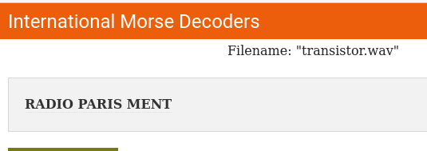

# Titi-tata

Un opérateur télégraphiste de votre réseau  a intercepté un message d’alerte précieux côté français. **Question : Quel est le contenu de ce message?**

## Solution

C'est sans nul doute du morse. En utilisant un décodeur en ligne :



Radio Paris ment, c'est quoi ? https://liberation-de-paris.gilles-primout.fr/radio-paris-ment-radio-paris-ment-radio-paris-est-allemand

Radio-Paris ment fait en fait écho à une parodie par Pierre Dac (https://www.youtube.com/watch?v=0WVmrt3WIuU). Il existerait même une fiction documentée avec Jean-Yves Lafesse dans le rôle de Pierre Dac (mais impossible de mettre la main dessus...) : https://www.lemonde.fr/televisions-radio/article/2016/06/25/pierre-dac-une-voix-de-londres_4957949_1655027.html

```
bleuetdefrance{radioparisment}
```

