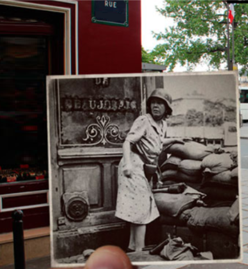

# Trip advisor		



Dans l’imaginaire collectif, il est compliqué de se dire qu’il y a presque 80 ans se tenaient de violents combats dans Paris. **Question : Quelle est la dénomination sociale du commerce qui se trouve en lieu et place de la barricade ?**

## Solution

Un challenge qui m'a valu un sacré casse-tête suite à une faute d'inattention...

Pour l'arrière-plan : un nom de rue astucieusement caché et une façade rouge. On remarque qu'on a une photo d'une femme casquée qui ressemble fortement à celle d'un [challenge précédent](./femme.md). Partons sur cette idée là en essayant de retrouver la position exacte de la barricade.

On sait qu'on est au "coin" de la rue de la Huchette à Paris. Plus précisément au croisement rue de la Huchette / place du Petit Pont à en croiser cette vue [aérienne](http://museedelaresistanceenligne.org/media4657-Barricade-angle-de-la-rue-de-la-Huchette-et-de-la-place-du-Petit-Pont) (?)


On cherche la dénomination sociale, autrement dit, le nom sous le quel est enregistré le magasin "dam dom". Pour cela, societe.com est une très bonne source. En cherchant bêtement "damdom", on trouve un résultat : https://www.societe.com/societe/damdom-532459021.html

Après avoir testé toutes les variantes (minuscule, majuscule, espace) : rien... Un détail que j'aurais dû voir plus tôt : le magasin qu'on cherche est dans le 5è arrondissement alors que le lien indique un magasin du 3ème... En affinant la recherche sur societe.com ("dam dom paris 5"), on trouve enfin le bon magasin qui est enregistré sous le nom "Bernard et compagnie"


Pour l'anecdote, sous un autre angle, on retrouve une plaque commémorative qui était utilisée dans un autre challenge :


```
bleuetdefrance{bernardetcompagnie}
```

