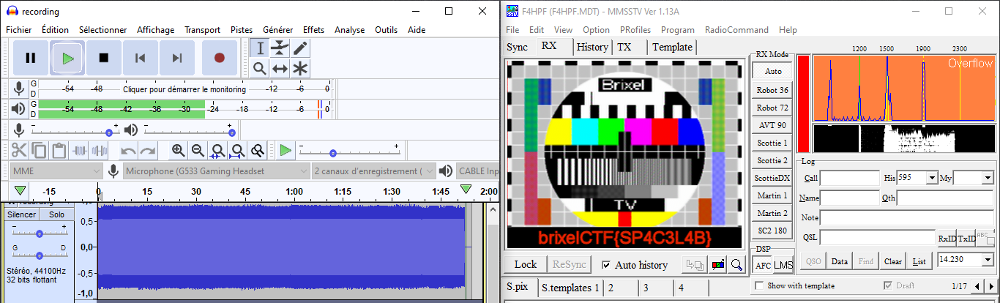

# A message from space

I received a message from space Beam me up scottie1!

## Walkthrough

Message from space + WAV file probably means SSTV. SSTV is a well-known image transmission protocole used by the ARISS Russian team that can be received and decoded by any ham radio operator https://amsat-uk.org/beginners/iss-sstv/

The WAV file given in the CTF is the recording of a session. The idea is:

- Reading the WAV file with Audacity.
- Creating a Virtual audio output, for instance with https://vb-audio.com/Cable/
- Using a SSTV decoder such as https://hamsoft.ca/pages/mmsstv.php that will listen to the virtual audio source.



## Flag

```
brixelCTF{SP4C3L4B}
```

