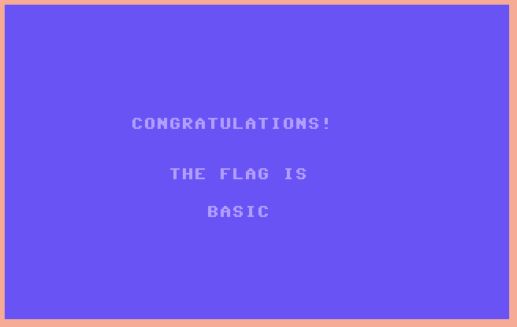

# The tape

I found this cassette tape from the '80s. I bet it has some cool games on it or something. Better start looking for someone who grew up in that era... :) **This flag is not in the usual format, you can enter it with or without the brixelCTF{flag} format**

## Walkthrough

The WAV file needs to be converted to a Commodore TAP: http://wav-prg.sourceforge.net/index.html

Then, this file can be run in a Commodore emulator such as: http://www.c64forever.com/



## Flag

```
basic
```

