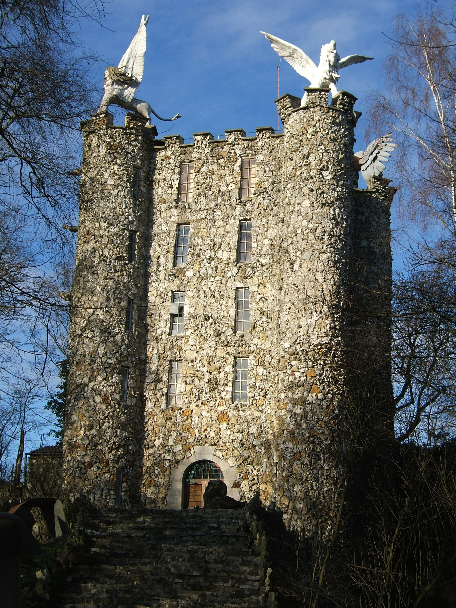

# A quick search

Here's an easy one to start off the OSINT challenges. I took this photo but forgot the name of this tower. Can you give me the name? I remember it started with an E. **This flag is not in the usual format, you can enter it with or without the brixelCTF{fl-ag} format**



## Walkthrough

Simple reverse search with [TinEye](https://tineye.com/) for instance. That's [Eben-Ezer](https://en.wikipedia.org/wiki/Eben-Ezer_Tower) tower, in Belgium.

## Flag

```
Eben-Ezer
```

