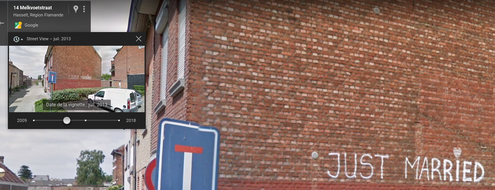

# Manhunt 8

So now you know where he lives, can you tell me what was written on his wall in 2013? **This flag is not in the usual format, you can enter it with or  without the brixelCTF{flag} format, replace spaces with underscores  ('_')** This is part of a series, more challenges will be unlocked once you  solve this one. While most challenges will be OSINT, some of them may  not be.

## Walkthrough

We can use the wayback feature available in Google Maps to see what was written on the wall in 2013.



## Flag

```
just_married
```

