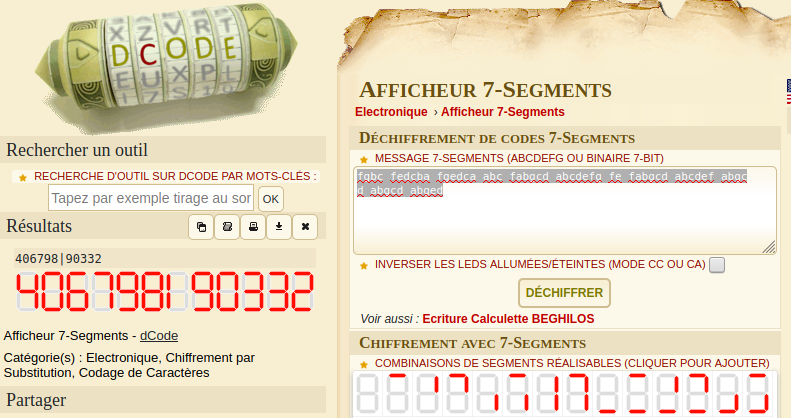

# An Arduino project

I once made this arduino program but forgot what it does. Unfortunately I lost the schematic that comes with it. Maybe you can get it running? **This flag is not in the usual format, you can enter it with or without the brixelCTF{flag} format**

## Walkthrough

We are given an [Arduino code](./arduino_project.ino). The interesting thing is in the comments: A, B, C... makes me think about 7-segment displays. We also have the wiring and the list of segments used in the `msg` variable. Several solutions:

- Get a real Arduino and a 7-segment display.
- Use a simulator.
- Or use an online [7-segment decoder](https://www.dcode.fr/7-segment-display)



## Flag

```
406798190332
```

