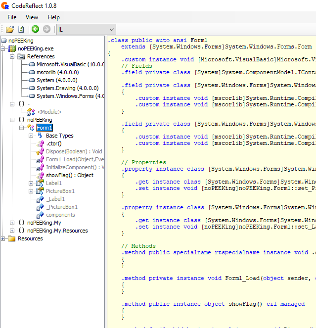
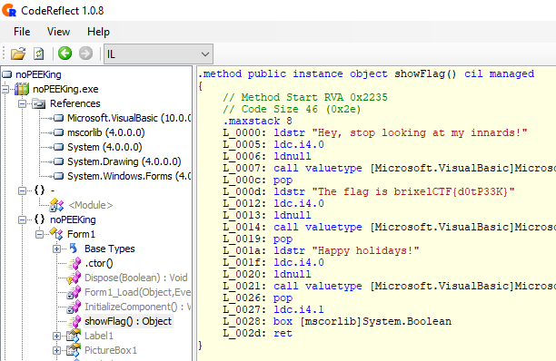

# No peeking!

Hidden inside this exe file is a flag Up to you to find it

## Walkthrough

It's a .NET compiled executable. https://devextras.com/decompiler/ is a simple .NET decompiler.



`showFlag()` seems to be an interesting function.



## Flag

```
brixelCTF{d0tP33K}
```

