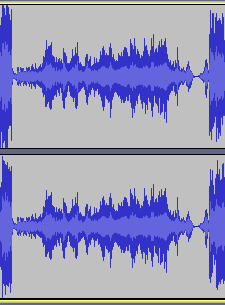
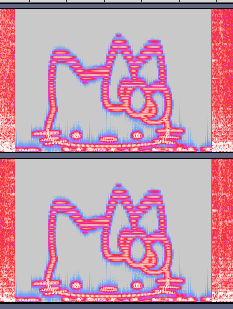

# Limewire audio

I downloaded this sweet tune from limewire, but there's something weird going on can you find the hidden message? The flag is the name of the character in english, no spaces! **This flag is not in the usual format, you can enter it with or without the brixelCTF{flag} format**

## Walkthrough

If we open the sound file with Audacity, there's a weird section in the middle:



In the spectrogram view, we can see Hello Kitty!



## Flag

```
hellokitty
```


