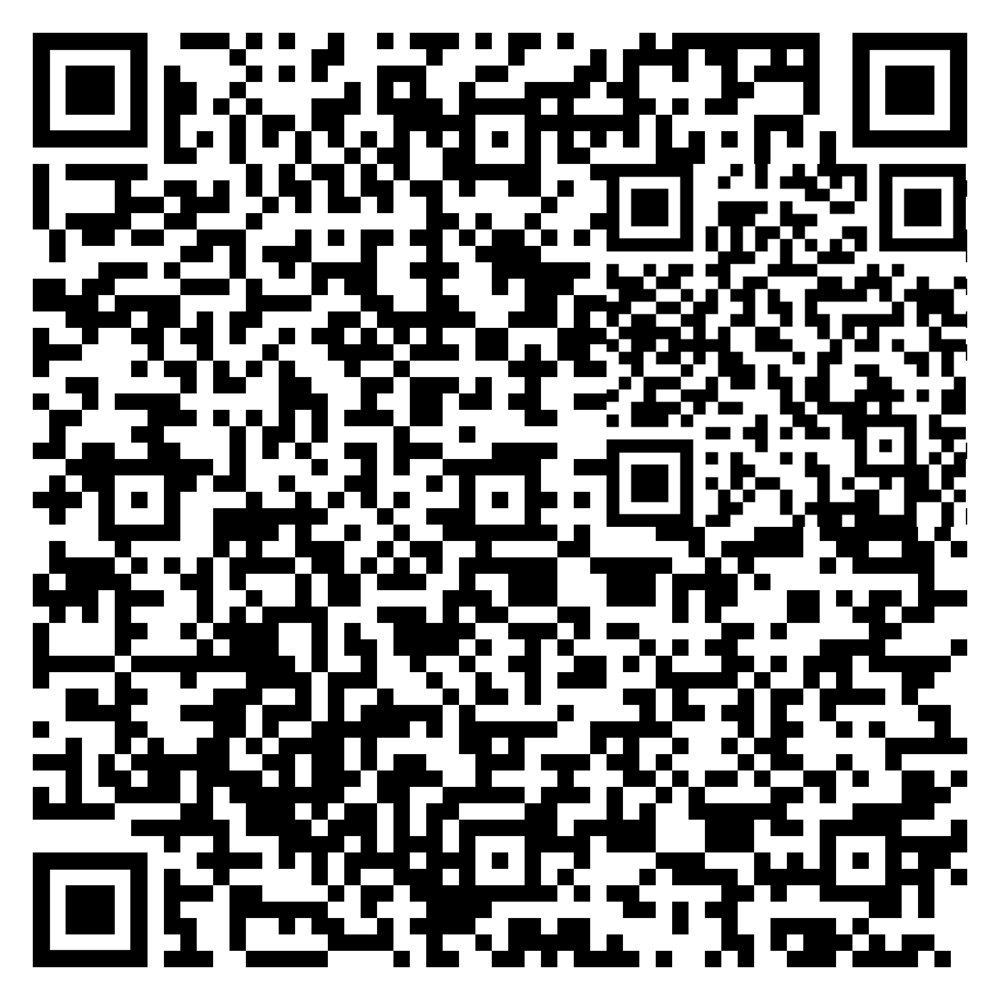

# Scan me

Can you solve this scan puzzle? It could be handy to hide messages

## Walkthrough

We have a QR code:



This QR code can be decoded thanks to: https://online-barcode-reader.inliteresearch.com/. It leads to another page where a few 1D barcode are given until the flag!

## Flag

```
brixelCTF{m4st3r_0f_sc4n5}
```

