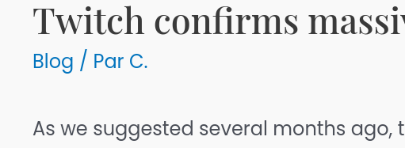
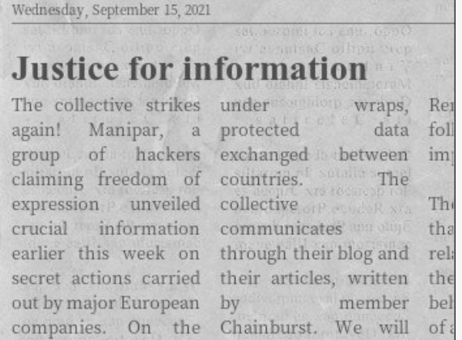

# Post

The first member of this group seems to be the one who posted the articles on Manipar's website. Can you find an alias of this member? Format: Flag{alias}

## Solution

Most articles are written by a user called C.



By changing the author parameter in the URL, we can find two other authors: admin8228 and delawareteam. Our target is C., we need to find a complete name. If we dump the whole blog and look at images, we have an interesting article with someone called Chainburst.



## Flag

```
flag{chainburst}
```

