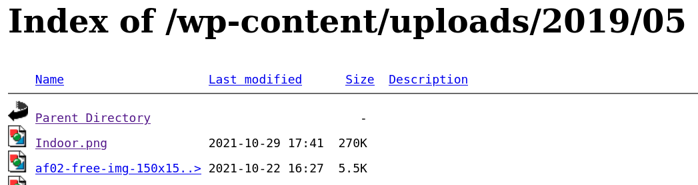
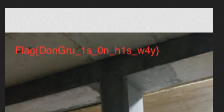

# Resources

DGSI analysts performed a first analysis on the site, and a photo containing information seems to be hidden in  the files of this Wordpress site. Find this photo. Format : Flag{you_will_know_this_is_a_flag}

## Solution

We had to look at the URL of any image on the blog. It seemed that we could explore `wp-include`. After a while, we found the flag:



 

## Flag

```
flag{DonGru_1s_On_h1s_w4y}
```

