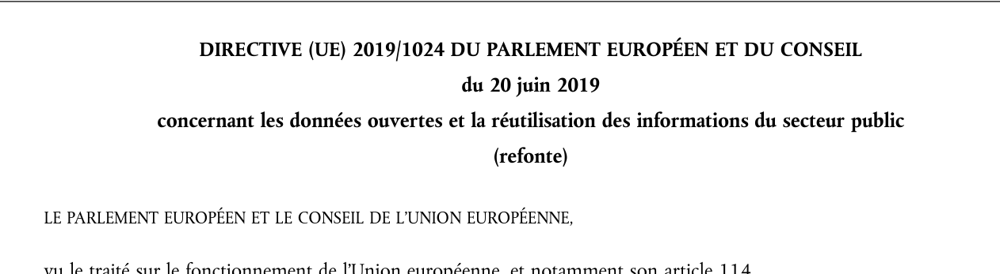
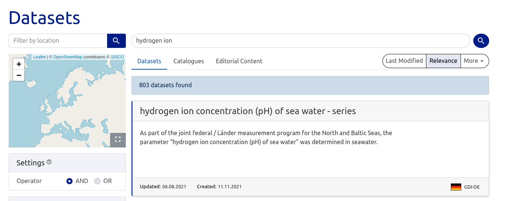
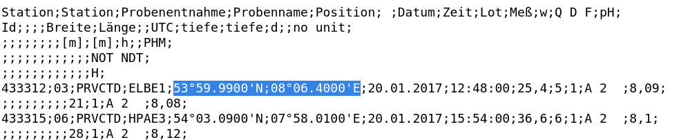

# Pollution

You found that boat! Our agents talked with the manager of that company, but the boat seems to be a dead end... Let's forget about that. It seems that this man is using his traffic to release supposed toxic material in northern seas. We made an hydrogen ion concentration study at this position: 53°59.99'N08°06.40'E. Could you find an hydrogen ion concentration measure made by an european public organisation, let say in January 2017? We need to compare these results to know if the released material is really toxic or not... Format: Flag{9,99} (it is a digital number with a coma)

## Solution

This challenge with only 5 tries, gave a lot of headaches to some teams. In fact, after quite a long time, we bought the hint.

> Directive (EU) 2019/1024 could be usefull to find this kind of information.

This hint is really useful. It is related to the use of open data in the European Union.



Searching "open data europe" leads us to: https://data.europa.eu/en

Searching for "hydrogen ion" gives us a very interesting topic for the first result:



Searching for 2017 in the XML file leads us to: https://data.bsh.de/Open_Data/MO_H_PH/MO_H_PH_2017.txt



If we look for the GPS coordinates given in the challenge, we get the pH concentration.

## Flag

```
flag{8,09}
```

