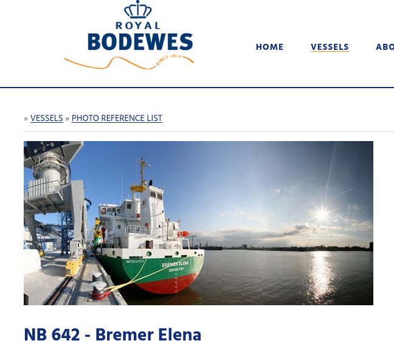

# Ship it

You found the wallet with which they do their traffic. The person who hold this wallet sent a message where he talks about a shipment. We only have a name in the message : BREMER ELENA. Find the formal name of the company which built this "BREMER ELENA". Format : Flag{NAME_OF_THAT_COMPANY}

## Solution

We have some information on Vesselfinder: https://www.vesselfinder.com/fr/vessels/BREMER-ELENA-IMO-9347073-MMSI-218861000

However, we don't want the current owner but the company that built this cargo. After some searches, we found it:



## Flag

```
flag{royal_bodewes}
```

