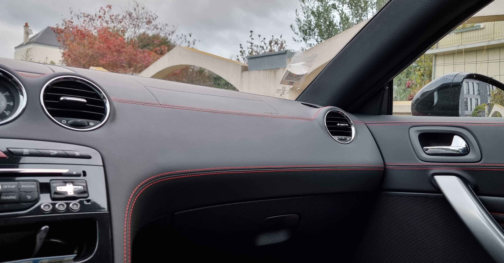
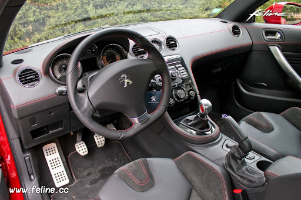
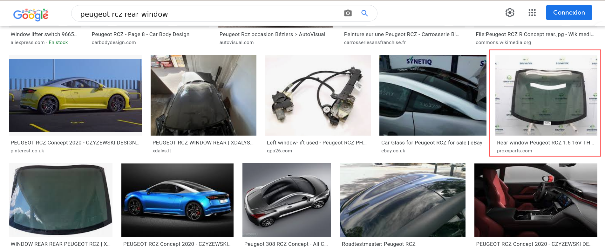
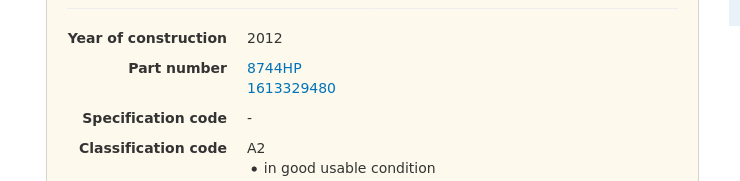
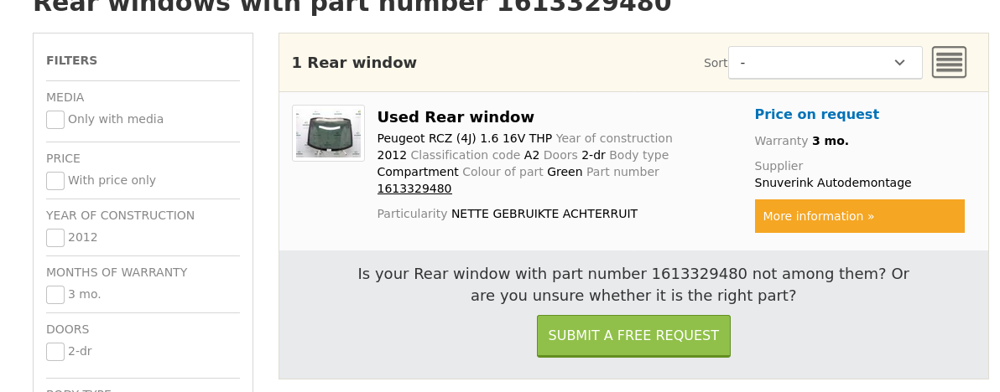

# The car

Cryptoka appears to have posted a photo of  his car indicating that his rear window had been smashed. We got our  hands on this photo. Find the manufacturer's reference for the rear  windscreen so that we can contact the dealers.



## Solution

From the bottom corner of the window, we know it's a Peugeot. One of my colleagues quickly recognized a Peugeot RCZ.



It seems to match! Now, let's look for Peugeot RCZ windows.



https://www.proxyparts.com/car-parts-stock/information/part-number/8744hp/part/rear-window/partid/15825380/




Solution found!



## Flag

```
flag{1613329480}
```

