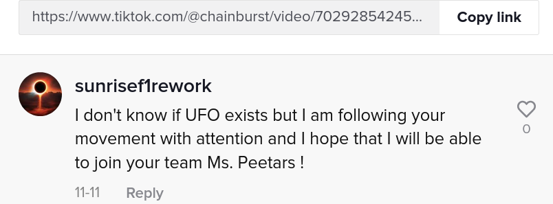
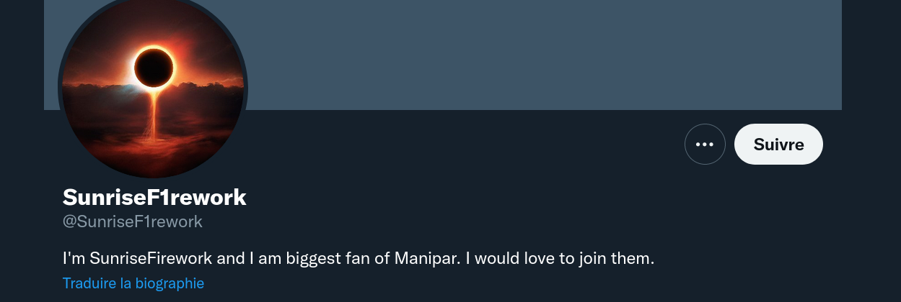
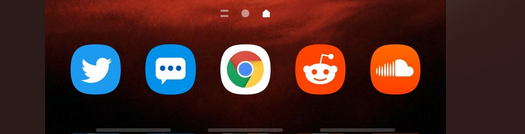

# Biggest fan

OK. We now know that Chainburst is posting information on social media. A person seems very interested by the videos. Find this person's accounts and send us all the information.

Format: Flag{you_will_know_this_is_a_flag}

## Solution

There's a comment in one of the videos on Chainburst's Tiktok:



This user has a Twitter account:



First tweet, he shares his smartphone with 3 applications (Twitter, Reddit, Soundcloud):



Each website contains a part of the flag!

## Flag

```
flag{M4nip4r_s3cr3t_h4ckt1v1t1s}
```

