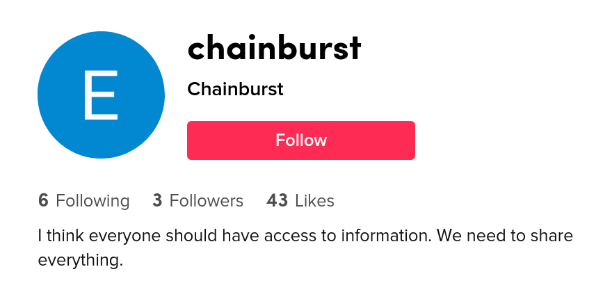
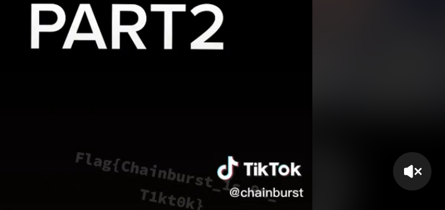

# Hello world

Congratulations. You have found the  first nickname of all. This one seems to share many messages through his articles. We think he communicates through networks to raise awareness  among the youngest. Find out which network he is sharing information on, you will need to retrieve a particular message. Format: Flag{you_will_know_this_is_a_flag}

## Solution

Among the youngest? What about Tiktok?



Someone interested in the access to information seems to be a good target. After looking at his videos, we find the flag:



## Flag

```
flag{chainbusrt_1s_0n_T1kt0k}
```

