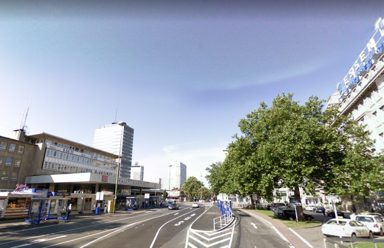
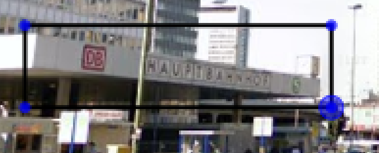
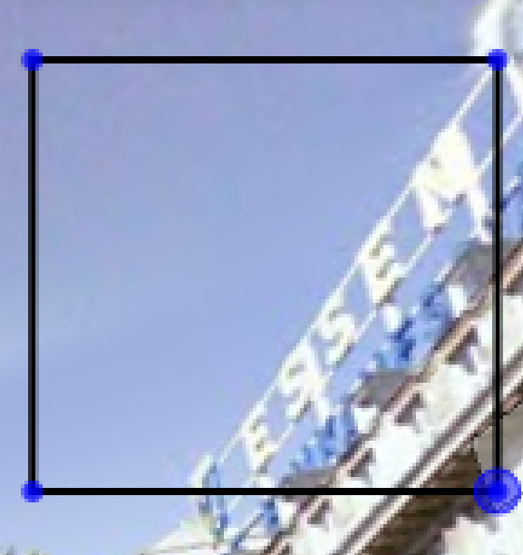
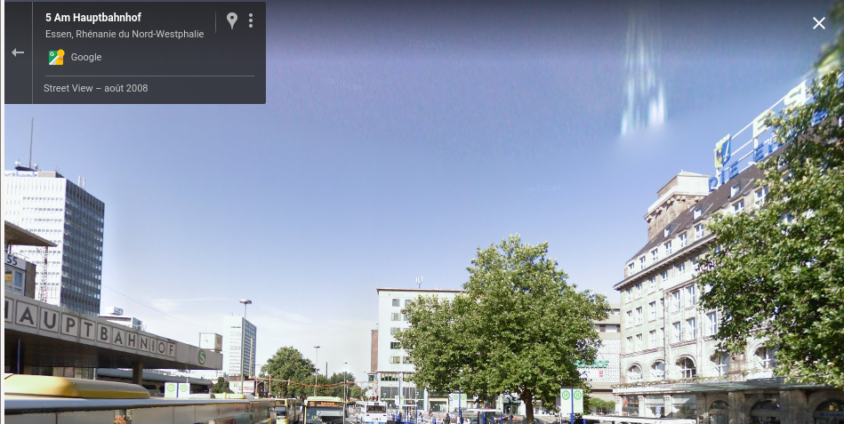

# Find the road

Good job, we managed to catch up our agent.  He sent us this picture. Can you pinpoint the road where it has been taken? Format : Flag{road_name}



## Solution





In other words, we're looking for the address of the train station of Essen in Germany!



## Flag

```
flag{hollestrasse}
```

