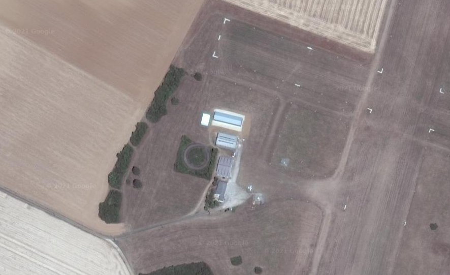
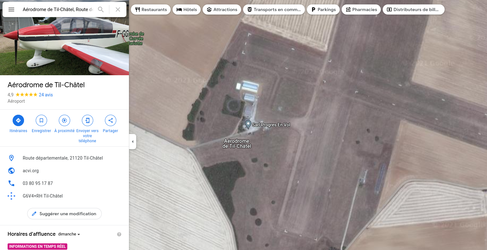

# Fly

Our agent found our suspect's car from the previous location and put a tracker on it. The satellite took a photo of the last known area but the triangulation from geographical data is incomplete... We only know that this place is in eastern France... Could you find the precise location and give us the city where the first photo has been taken? Format: Flag{city_name}



## Solution

Look for 10s of "aérodromes" in the East of France. After a while, found the right one!



## Flag

```
flag{til-chatel}
```

