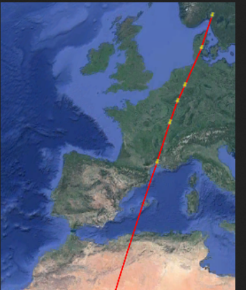
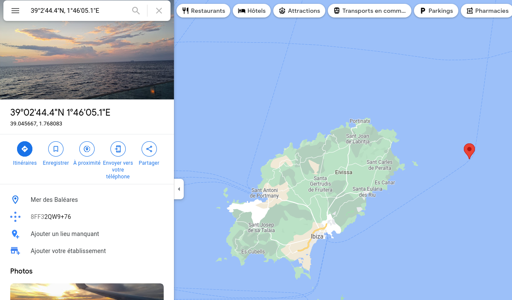
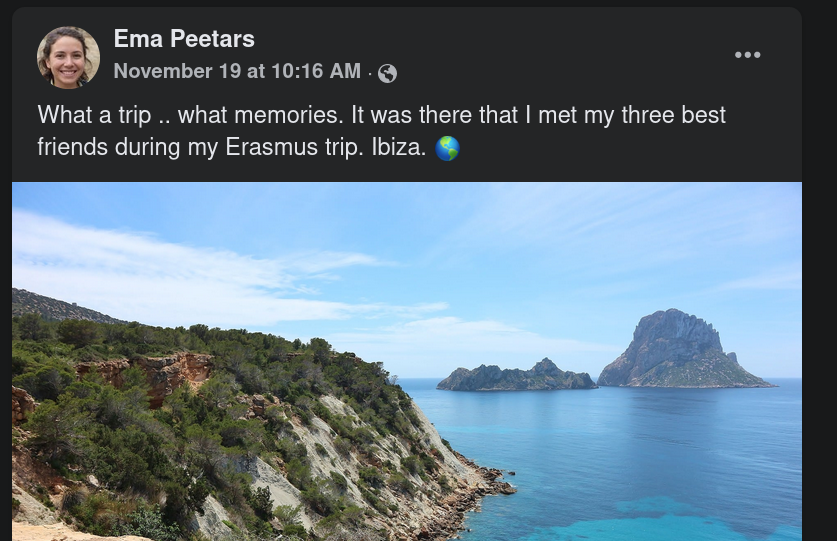

Further

Silence... Since the last location, we do not have any intel on this man... We do not have any clue on where he is heading. You are our last hope, find him, and it could lead to the gang! Format : Flag{zone}

> Hint: Extrapolate from his previous locations, get every information you have on him, and we hope you'll find...

## Solution

| City / Challenge          | Latitude          | Longitude        |
| ------------------------- | ----------------- | ---------------- |
| Halden, Norway            | 59°07'40.9"N      | 11°23'04.8"E     |
| Koldinghus, Demark        | 55°29'27.8"N (-4) | 9°28'29.3"E (-2) |
| Essen, Germany            | 51°27'08.3"N (-4) | 7°00'51.5"E (-2) |
| Roost, Luxembourg         | 49°46'32.7"N (-2) | 6°05'07.3"E (-1) |
| Aérodrome, Til-Chatel     | 47°32'42.7"N (-2) | 5°12'24.3"E (-1) |
| Statue, Palavas-les-Flots | 43°31'44.4"N (-4) | 3°56'05.1"E (-2) |

These points are +/- on the same line:



Furthermore, as we have to extrapolate, we can see a little logic in the GPS coordinates.

For the next point, what if we put latitude-4 and longitude-2 ?



It's +/- close to Ibiza, a location where Ema Peetars has met here friends (remember her Facebook profile)



## Flag

```
flag{ibiza}
```

