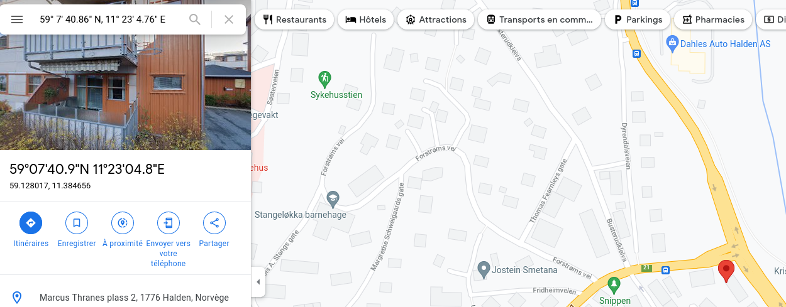

# Indoor

Congratulations, you have found this photo on the website. He seems to be ready to set out on a journey, we think he will lead us to his accomplices. Now, you have to exploit this photo and name us the city where this photo has been taken, so we can send an agent to follow him. Format: Flag{city_name}

## Solution

There are some coordinates in the EXIF metadata:

```bash
$ exiftool Indoor.png                             
[...]
GPS Latitude                    : 59 deg 7' 40.86" N
GPS Longitude                   : 11 deg 23' 4.76" E
GPS Latitude Ref                : North
GPS Longitude Ref               : East
GPS Position                    : 59 deg 7' 40.86" N, 11 deg 23' 4.76" E
```



## Flag

```
flag{halden}
```

