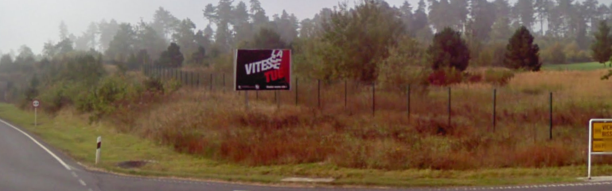
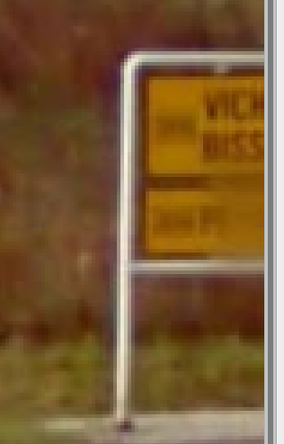
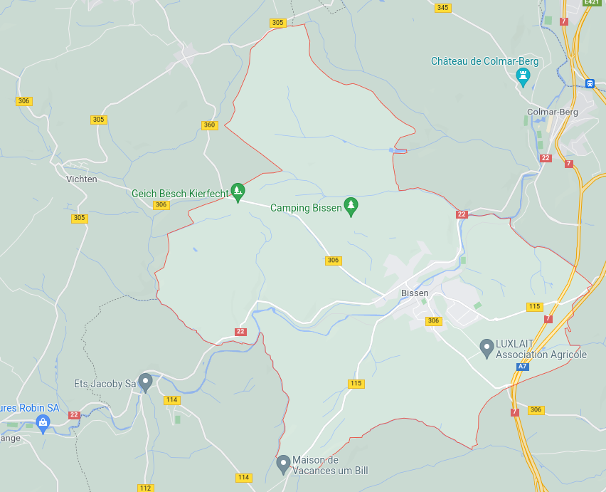
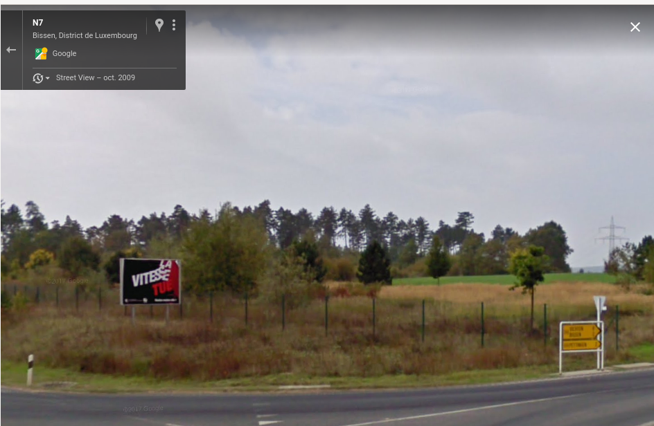
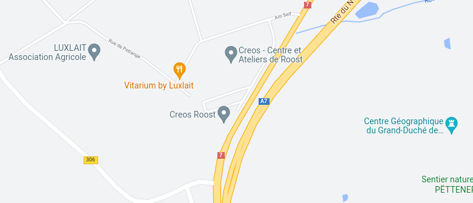

# On the road again

Our agent is chasing the criminal by car,  he took a photo in a hurry and did not set the geotags. He sent a voice mail precising that the criminal will need to stop very  soon, in the middle of the day, because of a technical problem on his  car. Can you locate the nearest locality from his location?     Format : Flag{locality_name}



## Solution

It's not in France for sure. From my own experience, I thought about Luxembourg.



With the zoom, we can look for two cities "Biss....." and "Vich......"



Found it! We're somewhere near Vichten and Bissen in Luxembourg. Now, we need to find the road.





## Flag

```
flag{roost}
```

