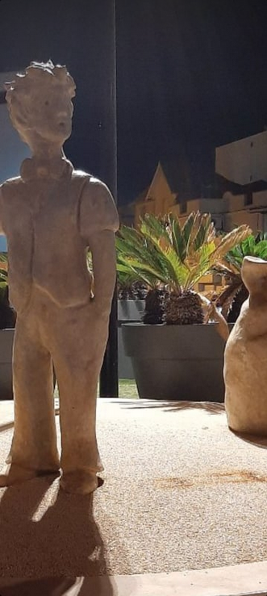
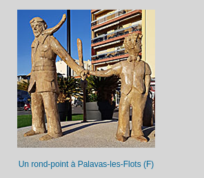

# The statue

He found the tracker in his car... He burnt it in the middle of a field and took a plane. Our agent lost his track, but we managed to intercept a message he sent to his partners.  Now we have this photo, but we do not know where it has been taken. Find the name of the city. Format: Flag{city_name}



## Solution

Don't know how but this statue makes me thought about "Le Petit Prince", a book written by Antoine de Saint-Exupéry, a famous airman/writter. Let's look for "le petit prince" statues. After a quick search: https://petit-prince-collection.com/lang/album.php?lang=fr



## Flag

```
flag{palavas-les-flots}
```

