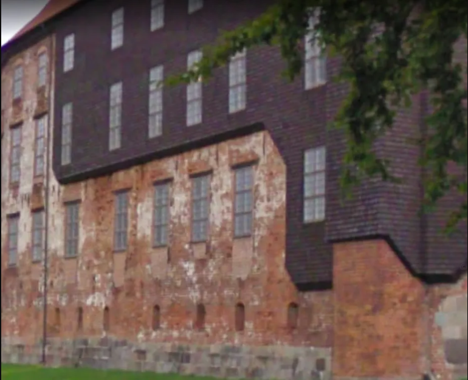
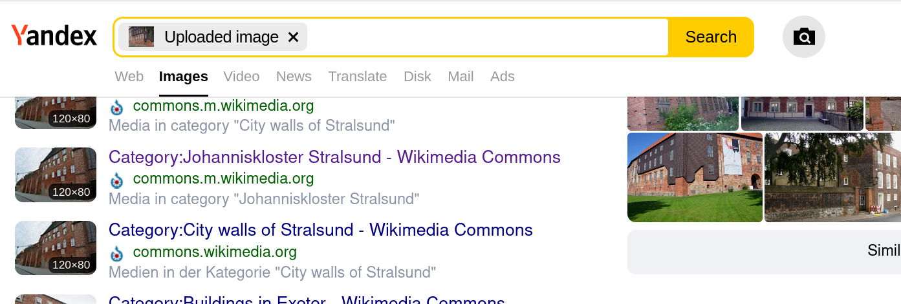
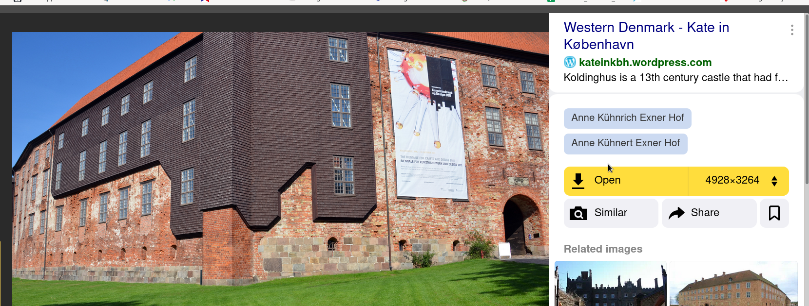
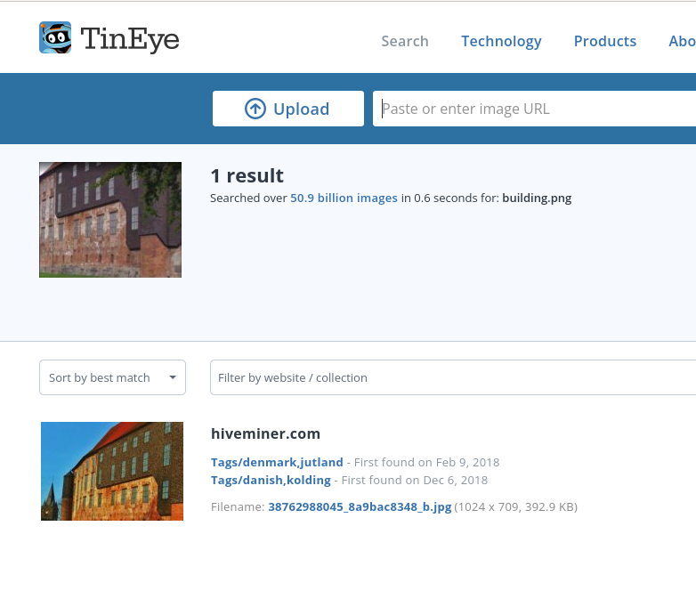

# Tourism

We lost contact with our agent, currently following this criminal on his trip. The photo was sent with his last message: "I can't believe it, he is doing tourism...".  This photo was joined with the message. Can you find the building's name so we can follow his route? Format : Flag{building_name}



## Solution

Got the image through Yandex:





We found our target!

NB: Tineye was even better for this challenge:



## Flag

```
flag{koldinghus}
```

