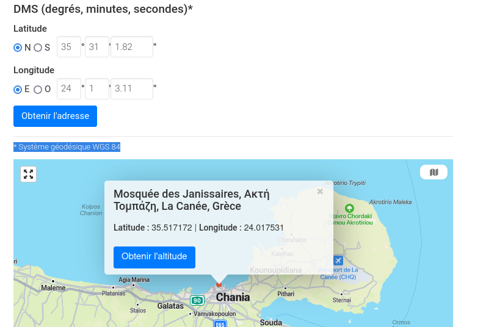
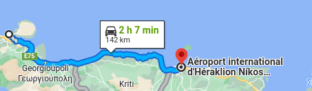

# Bonbon

Another message with a picture was received from "action man" on the phone previously found, but more recently : "We drove few hours and took the boat. We arrived at the safehouse yesterday. We are about to head East. Still 142km to go until  the airport near the fortress. Will be there for boarding in 3 days as planned."
Can you find the airport where they boarded?

Format : HEXA{airport_name}

## Method

```bash
$ exiftool safehouse.jpg
[...]
GPS Latitude                    : 35 deg 31' 1.82" N
GPS Longitude                   : 24 deg 1' 3.11" E
GPS Position                    : 35 deg 31' 1.82" N, 24 deg 1' 3.11" E
```



The location is in Crete. There are mainly two airports.

- La Cannée is too close to us.

- Heraklion airport matches the description (the FULL name was needed, not Heraklion nor Nikos...)



## Solution

```
HEXA{Aéroport international d'Héraklion Níkos-Kazantzákis}
```


