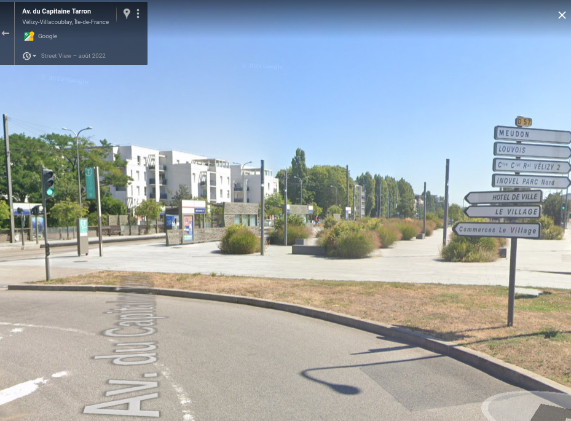

# Fast and furious

A witness saw a patrol vagon driving at top speed. We think it was the one carrying Lucilhe.
Can you retrieve the road's name where the picture was taken from?

Format : HEXA{french_street_name}

## Method

Google Maps is our friend here. We know it's near "Centre Commercial Velizy 2" and D57 road. Furthermore, there's a tramway stop in the background.



## Solution

```
HEXA{Avenue du Capitaine Tarron}
```


