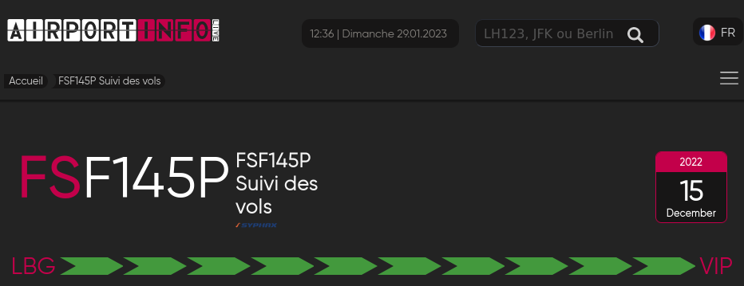
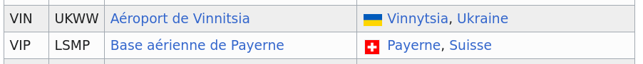
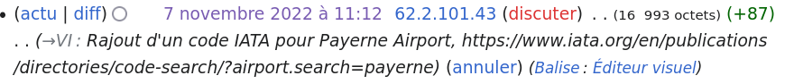

# Fly me to the moon

We found the place where they were hiding after the hijacking. The attachements are evidences we found there. Can you find the city they were heading to?

Format : HEXA{city}

## Method

Flight number on the paper:



Found the VIP IATA code on the French Wikipedia only: [Liste des codes AITA des aéroports/V — Wikipédia](https://fr.wikipedia.org/wiki/Liste_des_codes_AITA_des_a%C3%A9roports/V)



Fun fact: the IATA code has been recently added (by CTF admins?)



## Solution

```
HEXA{Payerne}
```


