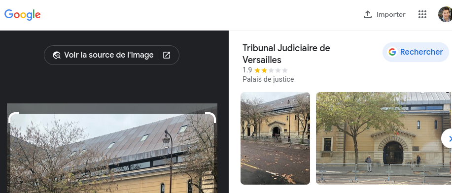

# Hijacking

The convoy transporting Lucilhe from "Maison d'arrêt de Versailles" was hijhacked on the 30th of November. She has not been seen since and her case file is incomplete. A tiny mistake has been made: the picture of the convoy's destination was provided but not the place's name. Please begin by completing the file with the name of this convoy's destination.

Format : HEXA{french_destination_name}

## Method

Google Lens



## Solution

```
HEXA{Tribunal Judiciaire de Versailles}
```


