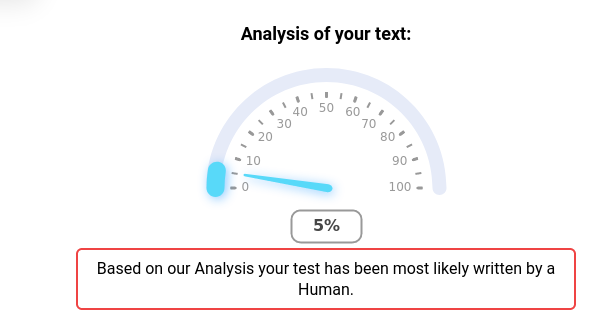

# Original

We contacted interpol about "action 
man". They have a biography record about him, but it seems something 
erased and rewrote the biography report several times. Forensics team 
managed to recover 12 different files but could not determine which one 
was written by a human...

Format : HEXA{report_number}
Exemple : HEXA{13}

WARNING : You have only one try to get the right answer

## Method

Quickly thought about ChatGPT. The challenge was mainly to find an accurate ChatGPT detector: https://detector.dng.ai/

File 8 was the only one to get a low score



## Solution

```
HEXA{8}
```


