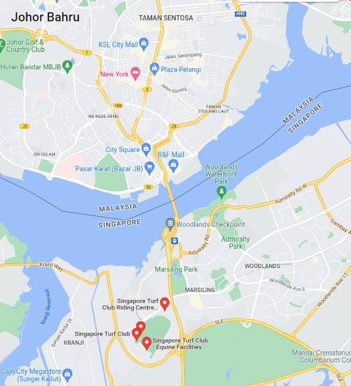

# Sovereign city

We intercepted a new message from "action man" sent days ago: "We will land at way 646940106, then we plan to hide near node 1803847939. Before we leave the city, we will change our car near way After that, relation 8810294 will allow us to leave the city by staying on the left lane." Find where they were hiding and the city they are heading to.

Format : Hexa{neighborhood_cityname}

## Method

Ways and relations are OpenStreetMap keywords. If we translate those, we get points in Singapore.

- [Way: 646940106 | OpenStreetMap](https://www.openstreetmap.org/way/646940106 "https://www.openstreetmap.org/way/646940106")

- [Node: 1803847939 | OpenStreetMap](https://www.openstreetmap.org/node/1803847939)

- [Way: ‪Marsiling Lane‬ (‪22762642‬) | OpenStreetMap](https://www.openstreetmap.org/way/22762642)

- [Relation: 8810294 | OpenStreetMap](https://www.openstreetmap.org/relation/8810294)

Second link gives the neighborhood. I spent two much time on "relation 8810294 will allow us to leave the city 
by staying on the left lane" and used Google Street View following the left lane... After asking an admin, I thought I should escape from Singapore:



## Solution

```
HEXA{Hougang_Johor Bahru}
```


