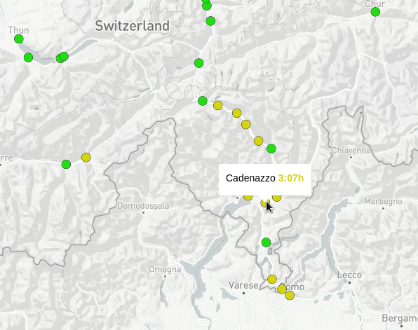

# Tank engine

We found evidence of their passage in a safehouse in the previous location you've found. The most interesting one is a phone with a received message weeks ago from a contact named "action man": "We took a direct train connection from Zurich. The journey takes 03:07. Our contact also confirmed the appointment." In which city did this appointment take place?

Format : HEXA{city}

## Method

[Chronotrains](https://www.chronotrains.com/fr?zoom=7.6&lng=10.19&lat=47.03&stationId=8503000) is a great tool to search for trains in a 5hrs limit. The original project (linked in Chronotrains description in even more interesting): https://direkt.bahn.guru/?origin=8503000

Then, we just search until finding the solution:



## Solution

```
HEXA{Cadenazzo}
```
