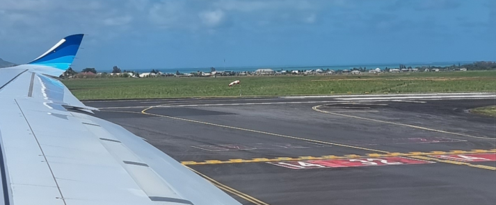
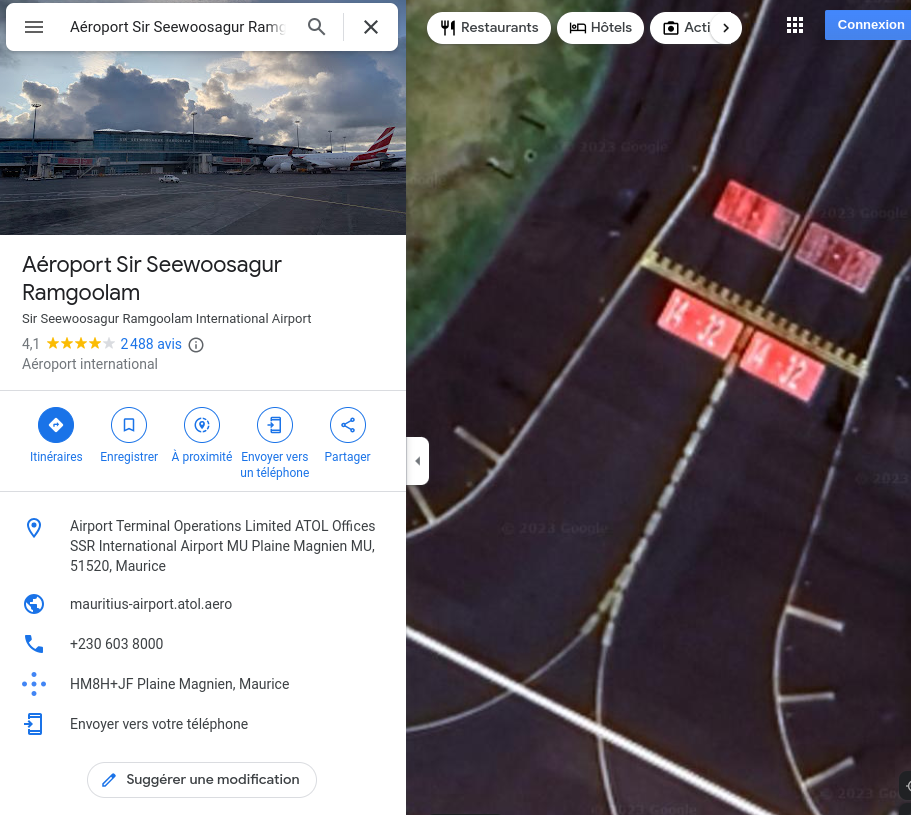

# Contract

We found evidence of their passage in a safehouse in Zurich. The most interesting one is a phone configured in romansh with a received picture attached to a message. This message is from a contact named "associate". Can you find the location where the picture was taken?

Format: HEXA{countryname}

## Method

Tried to shrink parts of the image:



The image through Google Lens leads me to Reunion, Mauritius and a few other airports.

Searched for them on Google Maps. Mauritius main airport was a good candidate:



- Same signs on the track

- Near the sea

- A mountain in the back

First try, got it! (this chall was limited in the number of submissions)

## Solution

```
HEXA{Mauritius}
```


