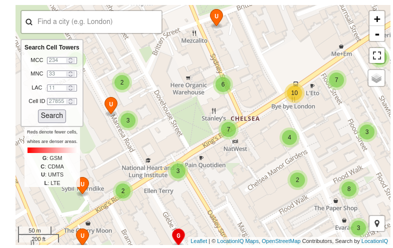

# Impersonator

We received a call from the contact "associate". The prefix of that number was 44. One of our agent answered the phone and the caller, a woman, told him : "Lian, it's me, I got the contract signed and I returned back at my place. Sell all your actions right now, the price is going to drop soon... Our system is getting more and more lucrative, it's a good thing. I hope the package is still on the way, our client is very influent worldwide, this could be useful... What is the current status?". Our agent tried to talk to the caller but  she hang up, guess our agent isn't such a good impersonator... As the call did not last long, we managed get data of the triangulation but these data are incomplete. Can you help us to know what neighborhood she was calling from using the world's largest Open Database of Cell Towers? Here are the data we managed to get :

- Antena operator : EE (previously Orange S.A)

- LAC : 11

- Cell ID : 27855

Format : HEXA{Neighborhood}

## Method

Quick search leads to https://opencellid.org

We already have LAC and CELL ID parameters. The call has been made with +44 prefix: it's the United Kingdom. Then, we had to find a list of MCC/MNC values for this country [https://mcc-mnc-list.com/list](https://mcc-mnc-list.com/list)

| 234 | 30  | GB  | United Kingdom | T-Mobile UK | EE  |
| --- | --- | --- | -------------- | ----------- | --- |
| 234 | 31  | GB  | United Kingdom | T-Mobile UK | EE  |
| 234 | 32  | GB  | United Kingdom | T-Mobile UK | EE  |
| 234 | 33  | GB  | United Kingdom | Orange      | EE  |
| 234 | 34  | GB  | United Kingdom | Orange      | EE  |



Chelsea in London!

## Solution

```
HEXA{Chelsea}
```


