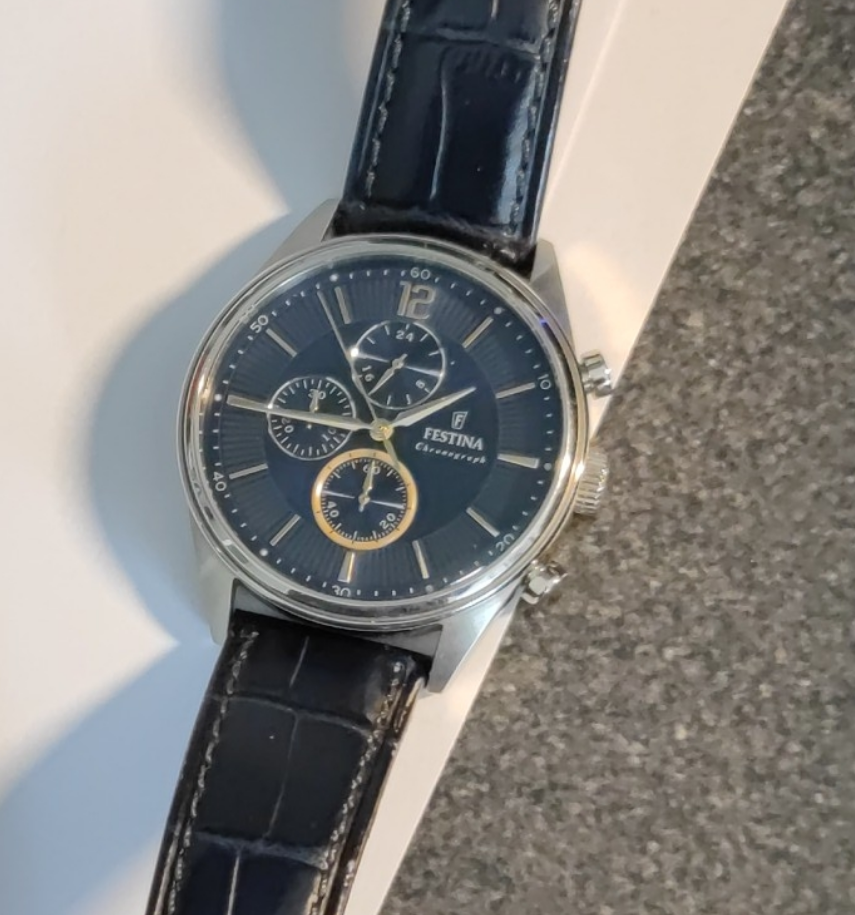
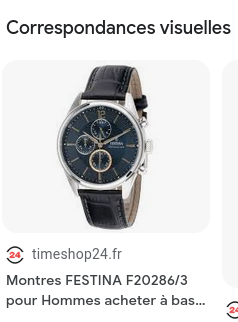

# Setup

Our forensics team dug into the telephone and found a deleted message sent to "associate" : "Hey dear, remember the gift you offered me few years ago? It just stopped  working... I'm so sad, your gifts are always plain but they fulfil me with joy. I will take it to the watchmaker ASAP, promise !". This watch could help us understand his definition of "plain", help us find the exact reference of the watch

Format : HEXA{ref_number}

## Method

Shrink the image on the watch and Google Lens it:





The challenge also contains a paper that may be useful later:


## Solution

```
HEXA{F20286/3}
```


