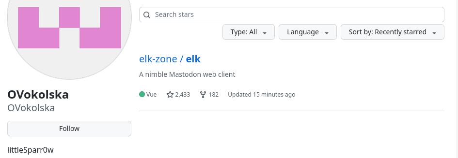
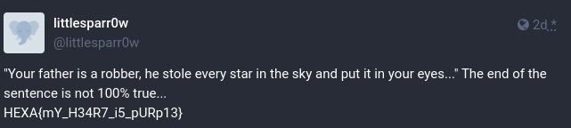

# Listen to your heart

Well done, now that you have found an account, let's try to find intimate information about this developer.

Format : HEXA{you_will_know_this_is_a_flag}

## Method

The Github profile contains another username `littleSparr0w`.  Tried this username with [Maigret](https://github.com/soxoj/maigret): nothing interesting...

The Github profile isn't active but the user starred only one project: a Mastodon client!



https://mastodon.social/api/v2/search?q=littleSparr0w

```json
{"accounts":[{"id":"109711364756806885",
"username":"littlesparr0w",
"acct":"littlesparr0w@cyberplace.social",
"display_name":"littlesparr0w",
"locked":false,"bot":false,"discoverable":false,"group":false,
"created_at":"2023-01-14T00:00:00.000Z",
"note":"",
"url":"https://cyberplace.social/@littlesparr0w",
"avatar":"https://static-cdn.mastodon.social/avatars/original/missing.png",
"avatar_static":"https://static-cdn.mastodon.social/avatars/original/missing.png",
"header":"https://static-cdn.mastodon.social/headers/original/missing.png",
"header_static":"https://static-cdn.mastodon.social/headers/original/missing.png",
"followers_count":0,"following_count":4,"statuses_count":0,"last_status_at":null,"emojis":[],"fields":[]}],"statuses":[],"hashtags":[]}
```

Got a link to a Mastodon instance and a flag!



## Solution

```
HEXA{mY_H34R7_i5_pURp13}
```


