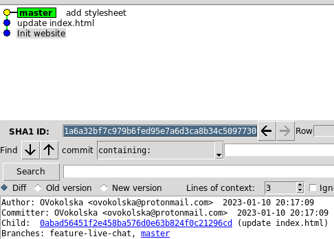
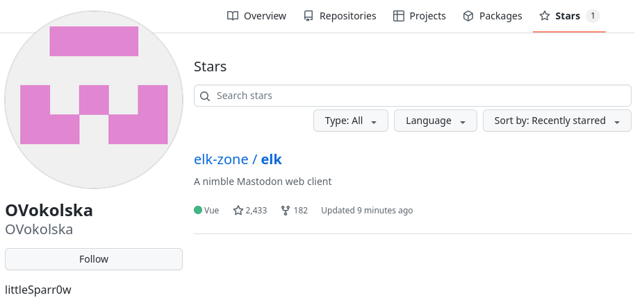
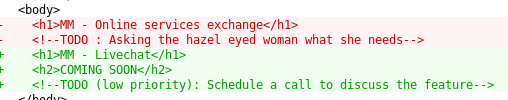

# Programming

This company is definitely suspicious. Someone must have developed their website and we would like to see if this person has any connection with our case. This person must have an account for his IT projects. Can you find it?

Format : HEXA{url}

## Method

Nothing on the website even in the footer where we can usually find such information. However, there's a backup on the Wayback Machine:


Developers usually use platforms such as Gitlab or Github to store code projects. Downloaded http://nelexat.ch/.git/ thanks to this great tool: https://github.com/arthaud/git-dumper



- A username: OVokolska

- An email address: ovokolska@protonmail.com

The username leads us to a Github profile:



Furthermore, there are two branches in this repository, the `feature-live-chat` branch is interesting:



- MM: like Mastermind?

- Schedule a call: made me think of a Google Agenda meeting needed in another challenge.

## Solution

```
HEXA{https://github.com/OVokolska}
```
