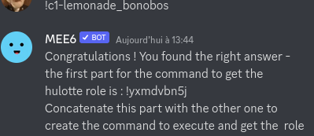
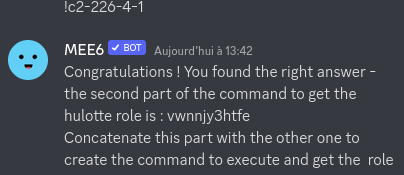

# Sneak beak

Great, you found the server! The detective seems to be looking for help. We need you to obtain the upper roles he is talking about. Start by gaining the next role after the Cheveche role.

Format : HEXA{command_to_get_role}

**Warning** : Do not forget to submit the flag here !

## Method

- **Challenge 1** We start easy. During my investigations I was able to find a recording. Can you tell me what is the title of what the protagonist sings? It will certainly help me to direct me on his nationality. (format: !c1-track_artist)

Got the answer after lots of tries with Google Assistant.



- **Challenge 2** I want to be sure you are qualified to help me. Tell me how much someone
   risk in France if they make an identity theft by giving me the penal 
  code article identifier. (format: !c2-123-1-1)

Quick search on Legifrance: https://www.legifrance.gouv.fr/codes/article_lc/LEGIARTI000042193593



## Solution

```
HEXA{!yxmdvbn5jvwnnjy3htfe} 
```
